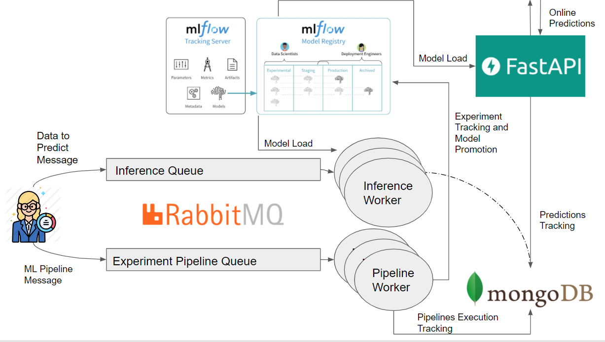
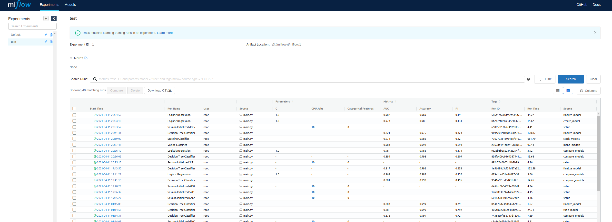
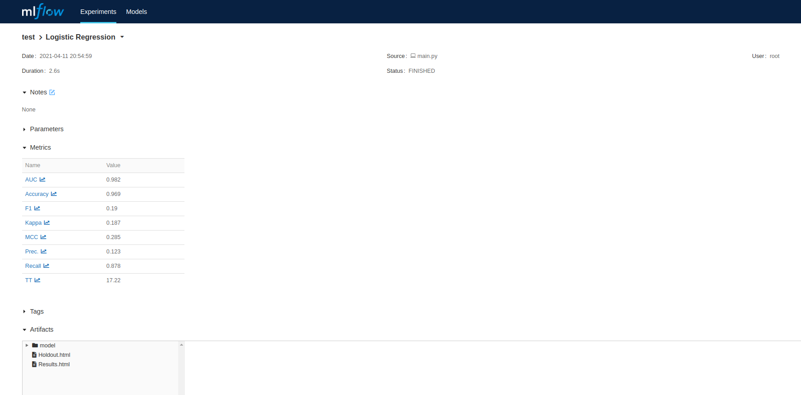
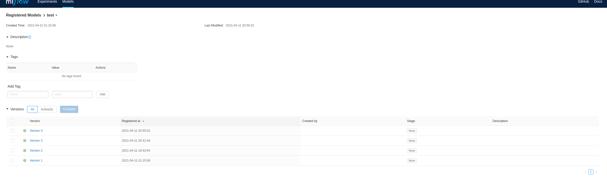
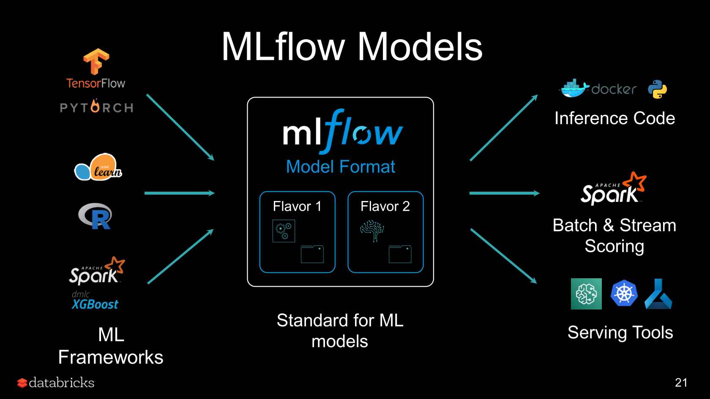
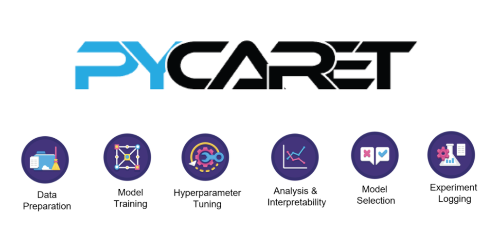
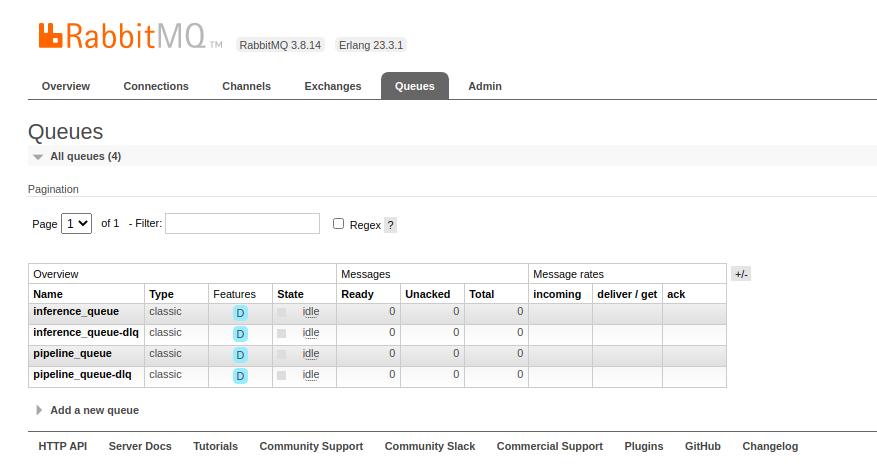
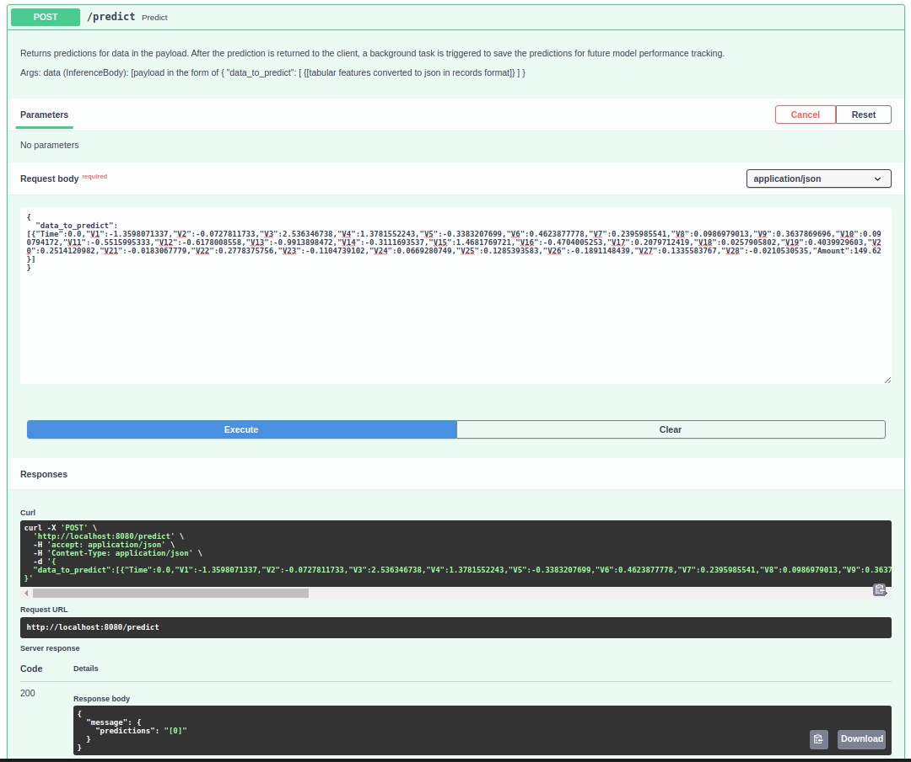
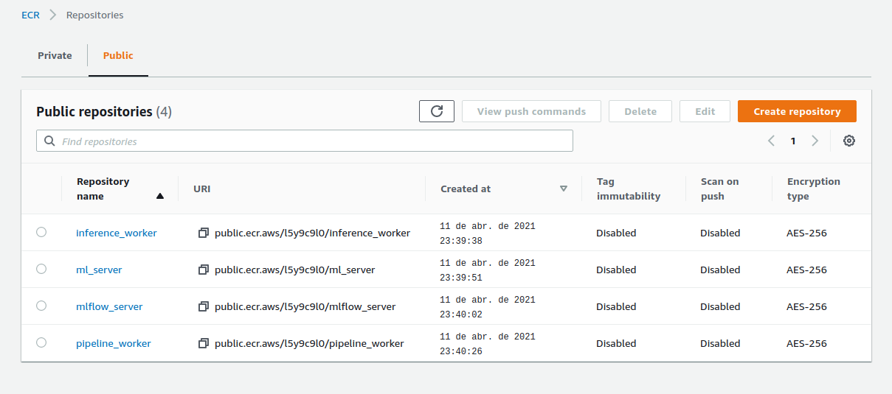

# ML Engineer challenge



This repo contains the architecture of services I have developed in order to automate every process in the ML cycle, **from  experimentation to deployment**. The main capabilities of the system are: 
- Automating machine learning experimentation and training of diferent models, dynamically building and executing ML training pipelines for every training job submitted, where every experiment pipeline is defined by a very simple json message.  
  In addition to that, this is done via a microservice using the AMQP protocol, meaning multiple jobs could be sent to a cluster running these workers at once, and these tasks would be queued up to be performed as resources become avaiable. Also making possible to scale workers if needed.
  Most importantly, each and every single experiment executed  by this worker will be throughly recorded using mlflow's model tracking server, also making it possible for the result  of a experiment to be "promoted" to production, using mlflow's model registry.  
- Serving models for
  - Batch Prediction: By also using the AMQP protocol, predictions can be made for any size of data, as the workers responsible for inference can be scaled both  horizontally and vertically. With  mlflow, making model  predictions via spark udfs also becomes possible, increasing even more inference performance.
  - Online Prediction: With the use of FastAPI, models can be served through endpoints offering low prediction latency.

After predictions are  made,  both in the microservice and api, they are stored in  adatabase in  order to make model  performance tracking possible in the future.
Every component in the project is containerized using docker, and setting all  of its services up is simple (as long as the .env file is properly set up):
`cd ml_app && docker-compose --env-file .env up`

## Main technologies used in the project

### MLFlow

At  the core  of the projects architecture, mlflow is responsible for centralizing all model information and files.  
With mlflow's tracking fucntion, it becomes possible to store, visualize and query any ml experiment  and  its metadata




With mlflow's model registry, it becomes possible to centralize models that have been "promoted" to be used  in  production, offering a simple way to retrieve, version and store them.



At the same  time, mlflow's python module makes using these models for inference and any deployment procedures simpler, as serializing any model to mlflow means making it compatible with its functions and downstream processes.  Regardless of model technology, through mlflow minimum to no changes are needed to update how models  are consumed.



### Pycaret

Pycaret is a low code ml library, full with functions to **quickly** easily engineer features,train, evaluate  and compare ml models for any  kind of problem. On its most recent versions, pycaret also gained compability with  mlflow, automatically logging its experiments, meaning metrics, model parameters,  plots  and even the model itself,  to  mlflow's tracking server.  



### RabbitMQ

RabbitMQ is a message broker for implementing AMQP systems. With RabbitMQ, it becomes possible to queue up requests to the system's microservices, which they  will consume as soon they becom  free. Another advantage is that each microservice listening to the queue will consume its messages  in  a round robin way, making possible and simple to scale a service horizontally.



### FastAPI
FastAPI is  a python API framework, created to have very high performance, going so far as to be on  par with NodeJS and Go.
Performant and powerful, it was chosen as the component for serving model predictions online, mainly to offer low latency predictions.


## Project Components

The project is based on 4 different components, each located in its respective directory:
- mlflow_server  
The core component of the project, the mlflow  server is responsible for storing tracking information regarding model experiments and  registering and versioning models chosen to be used for production and uploading them to the components so the models can be served.
The server stores its metadata in an sql server, while  storing  model artifacts in an AWS S3 remote bucket.

- pipeline_worker  
The Pipeline worker is responsible for,  throught the use of mlflow and pycaret, consume ML experiment pipeline definitions and execute them.  
This means that simply through a json message, multiple customized experiments can be sent to be executed  by the workers (which also  can  scale if needed), and every single time any model is evaluated  during these experiments, the results of them will be directly  logged to mlflow's server.  
The different "pipeline steps" which make a  full pipeline are  meant to be modular, making this component  easily extensible for adding new steps and increase  the overall possibilities of experiments.  
The `train_model` function parameters are directly mirrored from pycarets modules: [Classification](https://pycaret.org/classification/) and [Regression](https://pycaret.org/regression)

Example  of a pipeline  definition:
```json
{
    "pipeline":[
        {"MLSteps" : [
            {"load_data_from_kaggle" : {
                "kaggle_dataset_name" : "mlg-ulb/creditcardfraud",
                "training_file_name" : "creditcard.csv"
            }},
            {"train_model" : {
                "feature_engineering_params" : {
                    "fix_imbalance" : true,
                    "pca" : true,
                    "trigonometry_features" :true
                },
                "modeling_params" : {
                    "estimator_list" : ["rf","lightgbm","knn"],
                    "fold" : 10,
                    "n_select"  : 2,
                    "tune" : false,
                    "ensemble" : true
                },
                "finalize" :  false
            }},
            {"register_model" : {
                
            }}
        ]}
    ],
    "experiment_config" : {
        "experiment_name" : "credit_fraud_202112",
        "model_name" : "credit_fraud",
        "main_metric" : "F1",
        "problem_type":"classification",
        "target" : "Class"
    }
}
```
The pipeline above will:
- Download training data directly from kaggle
- Apply SMOTE to the data to mitigate class imbalance
- Apply PCA to the data
- Create trigonometry features from its original features
- Train Random Forest,LightGbm and a KNN model
- Cross validate each model with 10 folds
- Select the 2 most performant models out of the pool
- Ensemble these models by stacking and blending them
- Register the best performant model according to the desired metric (F1) in  the model registry
- Record the information  of every model evaluated to the tracking server
  
Another example of pipeline, showing how modular it they are, its building blocks being interchangeable:
```json
{
    "pipeline":[
        {"MLSteps" : [
            {"load_data_from_file" : {
                "path" : "/app/data/creditcardfraud.zip"
            }},
            {"train_model" : {
                "feature_engineering_params" : {
                    "fix_imbalance" : false,
                    
                },
                "modeling_params" : {
                    "estimator_list" : ["dt","lr"],
                    "fold" : 2,
                    "n_select"  : 1,
                    "tune" : false,
                },
                "finalize" : false
            }}
        ]}
    ],
    "experiment_config" : {
        "experiment_name" : "test",
        "model_name" : "test",
        "main_metric" : "Kappa",
        "problem_type":"classification",
        "target" : "Class"
    }
}
```

When models are serialized to mlflow, **the whole feature engineering pipeline is also serialized with the model**. This means that regardless of the  transformations  made by pycaret during the training phase, they will be saved and executed seemlessly whenever the model is downloaded from mlflow for executing predictions.
Lastly, to facilitate debugging and tracking of experiments, every pipeline ran  is also saved to a mongoDB collection.  

- ml_server   
  
Being used for online predictions, the  FastAPI server loads the desired  model from the registry, directly on startup. Predictions are  then served on its `/predict` endpoint. **After** each prediction is returned to the client, the predictions are saved to a mongodb collection, so as to make it possible to analyze model  performance later.   
A screenshot of FastAPIs  interactive documentation page running the model:



- inference_worker  
For making offline,  batch predictions, again the microservice + message broker archictecture was used. Messages with the data points  to be  predicted are  sent to the queue,  with  multiple data points being sent at every message. The inference workers then make and save the predictions and tracking data for model analysis to mongoDB collections.   
This way, it becomes possible to scale workers horizontally in order to scale the inference  capabilities  of the system  with  the amount of data.  

### CI/CD
Whenever  the master branch is updated,  through github actions the docker images for each  component are built, tagged and pushed to AWS ECR.  



### Next Steps

Some next steps to improve the project could be:
- Implementing data  and model  validation blocks for the pipeline
- Implementing unit tests for pipeline blocks
- Improved exception treatment
- CD process to update a  model endpoint as soon as a new model is  registered, since that can  happen even  if  the project code change  that would trigger the CI/CD pipelines doesn't change.
